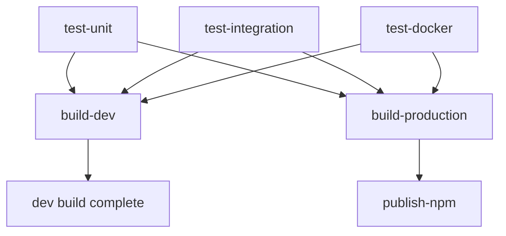

# 🚀 CI/CD Pipeline Guide

This document explains the enhanced CI/CD pipeline for YouTrack MCP, including testing, development builds, and production releases.

## 📋 Pipeline Overview

The pipeline consists of **3 main stages**:

1. **🧪 Testing** - Multiple test types with proper separation
2. **🔨 Dev Builds** - Automatic builds for development
3. **🚀 Production Builds** - Manual triggers for releases

## 🧪 Testing Stage

### Test Types

| Type | Marker | Description | When to Use |
|------|--------|-------------|-------------|
| **Unit** | `@pytest.mark.unit` | Fast tests, no external dependencies | Testing individual functions/classes |
| **Integration** | `@pytest.mark.integration` | Mock external services, test component integration | Testing API clients working together |
| **E2E** | `@pytest.mark.e2e` | Real API calls to YouTrack | Testing full workflows (requires credentials) |
| **Docker** | `@pytest.mark.docker` | Container build and startup tests | Testing Docker image functionality |

### Running Tests Locally

```bash
# All tests
pytest

# Specific test types
pytest -m unit              # Unit tests only
pytest -m integration       # Integration tests only  
pytest -m "unit or integration"  # Multiple types

# With coverage
pytest --cov=youtrack_mcp --cov-report=html

# E2E tests (requires real credentials)
export YOUTRACK_URL="https://your-instance.youtrack.cloud"
export YOUTRACK_API_TOKEN="your-token"
pytest -m e2e
```

### Test Organization

```
tests/
├── unit/           # Fast, isolated tests
├── integration/    # Component integration with mocks
├── e2e/           # End-to-end with real API
└── docker/        # Container-specific tests
```

## 🔨 Development Builds

### Automatic Triggers
- **When**: Push to `main` branch
- **What**: Builds Docker images with development tags
- **Tags Created**:
  - `tonyzorin/youtrack-mcp:{version}_wip`
  - `tonyzorin/youtrack-mcp:dev-{commit-sha}`
  - `ghcr.io/tonyzorin/youtrack-mcp:{version}_wip`
  - `ghcr.io/tonyzorin/youtrack-mcp:dev-{commit-sha}`

### Usage
```bash
# Use the latest WIP build
docker pull tonyzorin/youtrack-mcp:1.11.6_wip

# Or specific commit
docker pull tonyzorin/youtrack-mcp:dev-b7858ce
```

## 🚀 Production Builds

### Manual Triggers

Go to **GitHub** → **Actions** → **CI/CD Pipeline** → **Run workflow**

### Options

| Option | Description | Default |
|--------|-------------|---------|
| **Release Type** | `patch`, `minor`, `major`, `custom` | `patch` |
| **Custom Version** | Specific version (only if type=custom) | - |
| **Create Release** | Create GitHub release | `true` |
| **Publish Packages** | Publish NPM packages | `true` |

### Examples

#### Patch Release (1.11.6 → 1.11.7)
```
Release Type: patch
Create Release: ✓
Publish Packages: ✓
```

#### Minor Release (1.11.6 → 1.12.0)  
```
Release Type: minor
Create Release: ✓
Publish Packages: ✓
```

#### Custom Version
```
Release Type: custom
Custom Version: 2.0.0
Create Release: ✓
Publish Packages: ✓
```

### Production Tags Created
- `tonyzorin/youtrack-mcp:{version}`
- `tonyzorin/youtrack-mcp:latest`
- `ghcr.io/tonyzorin/youtrack-mcp:{version}`
- `ghcr.io/tonyzorin/youtrack-mcp:latest`

## 📦 Multi-Registry Support

### Docker Hub (Primary)
```bash
docker pull tonyzorin/youtrack-mcp:latest
docker pull tonyzorin/youtrack-mcp:1.11.6
```

### GitHub Container Registry (Backup)
```bash
docker pull ghcr.io/tonyzorin/youtrack-mcp:latest
docker pull ghcr.io/tonyzorin/youtrack-mcp:1.11.6
```

## 🔧 Workflow Details

### Dependencies


### Conditional Execution

| Event | Unit Tests | Integration Tests | Docker Tests | E2E Tests | Dev Build | Prod Build |
|-------|------------|-------------------|--------------|-----------|-----------|------------|
| **PR** | ✅ | ✅ | ✅ | Only if labeled | ❌ | ❌ |
| **Push to main** | ✅ | ✅ | ✅ | ❌ | ✅ | ❌ |
| **Manual trigger** | ✅ | ✅ | ✅ | ❌ | ❌ | ✅ |

### E2E Test Triggers
E2E tests run only when:
- Real YouTrack credentials are available in secrets
- PR is labeled with `e2e-tests` (manual)
- Credentials: `YOUTRACK_URL` and `YOUTRACK_API_TOKEN`

## 🛠️ Local Development Workflow

### 1. Feature Development
```bash
# Create feature branch
git checkout -b feature/my-feature

# Make changes
# ...

# Run tests locally
pytest -m unit
pytest -m integration

# Create PR
# → Triggers: unit, integration, docker tests
```

### 2. Ready for Testing  
```bash
# Merge to main
git checkout main
git merge feature/my-feature
git push origin main

# → Triggers: all tests + dev build
# → Creates: tonyzorin/youtrack-mcp:1.11.6_wip
```

### 3. Ready for Release
```bash
# Go to GitHub Actions
# Run workflow: CI/CD Pipeline
# Choose release type: patch/minor/major
# → Creates: production images + GitHub release + NPM packages
```

## 📊 Monitoring

### GitHub Actions
- **Logs**: GitHub → Actions → CI/CD Pipeline
- **Summaries**: Rich summaries with Docker image info
- **Artifacts**: Coverage reports, build logs

### Coverage
- **Codecov**: Integrated coverage reporting
- **HTML Reports**: Available as artifacts
- **Threshold**: 80% minimum coverage

## 🔍 Troubleshooting

### Common Issues

#### Tests Failing
```bash
# Check specific test type
pytest -m unit -v
pytest -m integration -v

# Check coverage
pytest --cov=youtrack_mcp --cov-report=term-missing
```

#### Docker Build Issues
```bash
# Test locally
docker build -t youtrack-mcp-test .
docker run --rm youtrack-mcp-test

# Check workflow logs
# GitHub → Actions → CI/CD Pipeline → Docker Tests
```

#### E2E Tests Skipped
```bash
# Add secrets to repository
# Settings → Secrets → Actions
# Add: YOUTRACK_URL, YOUTRACK_API_TOKEN

# Or add label to PR
# Label: "e2e-tests"
```

### Manual Production Build Issues

#### Version Bump Script
```bash
# Test version bump locally
python scripts/version_bump.py patch --dry-run

# Check current version
python -c "exec(open('youtrack_mcp/version.py').read()); print(__version__)"
```

#### Docker Registry Issues
- **Check secrets**: `DOCKER_USERNAME`, `DOCKER_PASSWORD`
- **Verify permissions**: GitHub token permissions
- **Check logs**: Docker build step logs

## 🎯 Best Practices

### Testing
- ✅ Write unit tests for new functions
- ✅ Add integration tests for API interactions  
- ✅ Use proper test markers
- ✅ Mock external dependencies
- ✅ Maintain coverage above 80%

### Development
- ✅ Use feature branches
- ✅ Test locally before pushing
- ✅ Use dev builds for testing
- ✅ Only create production releases when ready

### Releases
- ✅ Use semantic versioning
- ✅ Test with WIP builds first
- ✅ Create GitHub releases for major changes
- ✅ Update documentation as needed

## 📚 References

- [Semantic Versioning](https://semver.org/)
- [Pytest Markers](https://docs.pytest.org/en/latest/example/markers.html)
- [GitHub Actions](https://docs.github.com/en/actions)
- [Docker Multi-platform Builds](https://docs.docker.com/build/building/multi-platform/) 